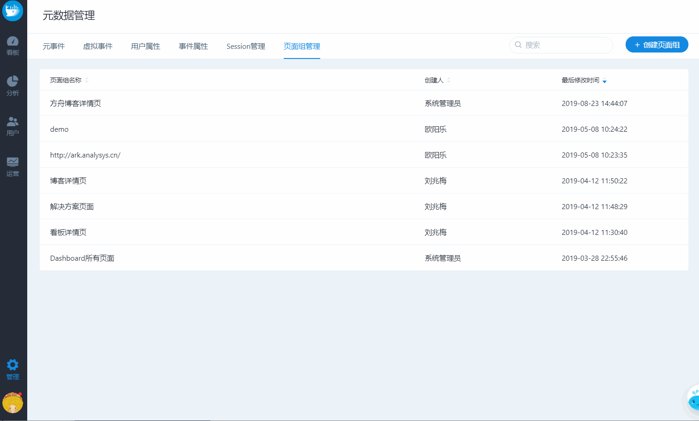

# 页面组管理

页面组是具有共同结构特征的页面集合，如商品详情页、新闻资讯页；可用于基础指标分析或热图分析。

## 1 创建页面组

可以设定一组或多组 URL 规则快速匹配一组具有相同结构的页面，支持 5 种URL规则：包含、开头为、结尾为、等于、正则表达式：

### 包含

任何包含输入字符串的URL。e.g. 输入URL 包含 abc，则将筛选出 abc.com、ark.abc.cn 等类似的URL；

### 开头为

任何开头为输入字符串的URL。e.g. 输入URL开头为http://www.example.com/category=1，则将筛选出http://www.example.com/category=1\&id=1、http://www.example.com/category=1\&id=2 等所有分类下的URL；

### 结尾为

任何结尾为输入字符串的URL。e.g. 输入URL结尾为 project-management，则将筛选出 http://www.example1.com/project-management 、 http://www.example2.com/project-management 等URL；

### 等于

和输入URL完全一样的网址，支持输入多个地址；

### 正则表达式

符合正则表达式的URL，通过通配符、定位符、分组等符号组成逻辑公式。e.g. (?=.\*page.\*)(?!.\*otherpage).\* 筛选出包含page 但是不包含 otherpage 的所有页面。


规则中输入多个地址或特征时英文分号分隔


## 2 页面组管理

页面组的修改、复制、删除

.png>)

## **附 正则表达式常用语法**

正则表达式使用单个字符串来描述、匹配一系列匹配某个句法规则的字符串，是对字符串操作的一种逻辑公式。

### 常用字符

正则表达式字符主要包含：通配符、定位符、分组等。

**通配符，**可以用来代替一个或多个字符，常用的有

| 符号 | 说明                | 示例                                                   |
| -- | ----------------- | ---------------------------------------------------- |
| \* | \*前的字符重复出现n次（n≥0） | 
表达式是 argo*ark 

则argoark、argooooark都可以匹配
 |
| ？  | ？前的字符重复出现0次或1次    | 
表达式是 argo？ark 

则只能匹配出argoark、argark
     |

**定位符，**基于指定位置的匹配，通常在开始或结束的位置

| 符号 | 说明       | 示例                                                                              |
| -- | -------- | ------------------------------------------------------------------------------- |
| ^  | 从开头匹配字符串 | 
表达式是 ^ark

则 ark.analysys.cn、arkargo 可以匹配，但 docs.ark、argoark 等不匹配
   |
| $  | 以结尾匹配字符串 | 
表达式是 ark$

则 doc.ark.cn、argoark 可以匹配，但 ark.analysys.cn、arkargo 等不匹配
 |

更多可参考 [https://developer.mozilla.org/zh-CN/docs/Web/JavaScript/Guide/Regular_Expressions](https://developer.mozilla.org/zh-CN/docs/Web/JavaScript/Guide/Regular_Expressions)

### **常用示例**

****

| 常见用法                                                   | 示例                                                                                                                                                                                                                                                                                                                 |
| ------------------------------------------------------ | ------------------------------------------------------------------------------------------------------------------------------------------------------------------------------------------------------------------------------------------------------------------------------------------------------------------ |
| 头部域名完全匹配 ，尾部带/或带?加参数                                   | 
表达式：^https:\/\/www.analysys.cn($|\/$|\/\?.*) 

能匹配以下页面： https://www.analysys.cn https://www.analysys.cn/ https://www.analysys.cn/?utmsource=xx 

不能匹配以下页面： https://www.analysys.c/abc
                                                                                           |
| 头部匹配 http 或 https 协议，并且匹配多个子域名                         | 
表达式：^(http|https):\/\/(ark|argo|qianfan).analysys.cn 

匹配以下页面： http://ark.analysys.cn http://argo.analysys.cn https://ark.analysys.cn https://ark.analysys.cn/?utmsource=xx https://qianfan.analysys.cn 

不能匹配以下页面： https://www.analysys.cn
                               |
| 指定头部匹配规则                                               | 
表达式：^http:\/\/analysys\.cn\/blog.*$ 

匹配以下页面： http://analysys.cn/blog http://analysys.cn/blog/ http://analysys.cn/blog/1194 http://analysys.cn/blog/1194#xxx
                                                                                                                            |
| 匹配 http 或 https开头链接，也可匹配不包含www或将www替换成其它由字母数字组合的子域名的情况 | 
表达式：^(http|https):\/\/[a-z0-9]*[.]*analysys.cn\/view\/sign\/signup$ 

匹配以下页面： http://www.analysys.cn/view/sign/signup https://www.analysys.cn/view/sign/signup http://analysys.cn/view/sign/signup http://ark.analysys.cn/view/sign/signup https://analysys.cn/view/sign/signup
      |
| 匹配末尾数据必须在（10603到10782之间）                               | 
表达式：^http:\/\/analysys.cn\/blog\/10([6][1-9][0-9]|[6][0][3-9]|[7][0-7][0-9]|[7][8][0-2])$

 匹配以下页面： http://analysys.cn/blog/10603

http://analysys.cn/blog/10666 http://analysys.cn/blog/10782

 不能匹配以下页面： http://analysys.cn/blog/10884 http://analysys.cn/blog/10103 
 |


以上内容没有解答我的问题？[点击我来反馈](https://support.qq.com/products/118522/) 🚀

