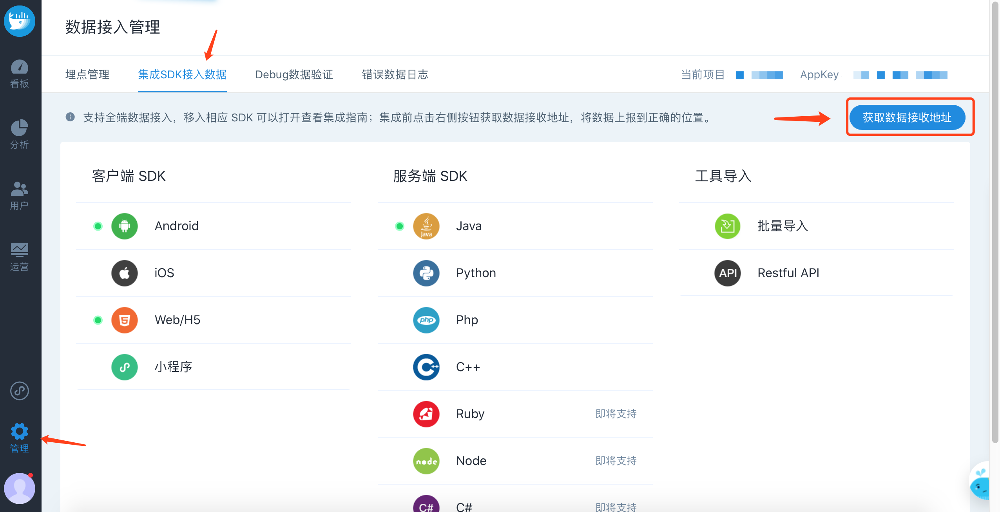

# 快速集成

通过以下方式可以快速完成SDK的集成，更多方式请查SDK集成文档

## 集成配置

### 选择集成工具



**注意：aar集成方式需要android sdk V4.4.0以上版本才支持，**

**远程aar配置**\
**     **`dependencies`\
`  {  `\
`//默认使用最新版本SDK，如需要使用特别版本请指定版本号 implementation('cn.com.analysys:analysys-arkanalysys:4.5.13')`\
`}`



1.将需要的 jar 包拷贝到本地工程 libs 子目录下；在Eclipse中右键工程根目录，选择 `property —> Java Build Path —> Libraries` ，然后点击 Add External JARs... 选择指向 jar 的路径，点击 OK，即导入成功。（ADT17 及以上不需要手动导入）



## 获取上报地址

登录易观方舟系统后点击”管理“——”数据接入管理“——”集成SDK接入数据”——“获取数据接收地址”

点击后即可获取您的数据上报地址。



## 基础模块

以下接口生效依赖于基础SDK模块，

### 初始化接口

建议在应用 Application 中调用 SDK 初始化接口 init()， 配置 AppKey、Channel，注意：初始化接口为必须调用接口。 接口如下:

```java
public static void init(Context context, AnalysysConfig config);
```

* context ：应用上下文对象
* config ：为自定义实体 bean，用于设置初始化属性值，目前config支持的属性有：
  1. AppKey：在网站获取的 AppKey
  2. channel：应用下发的渠道
  3. setAutoTrackClick：是否开启全埋点点击事件， 默认值：`false`

### 设置上传地址

自定义上传地址，接口设置后，所有事件信息将上传到该地址。 接口如下：

```java
public static void setUploadURL(Context context, String url);
```

* context：应用上下文对象
* url：数据上传地址，格式为 `scheme://host + :port`(不包含`/`后的内容)。**scheme** 必须以 `http://` 或 `https://` 开头，**host** 只支持域名和 IP，取值长度 1 - 255 字符，**port** 端口号必须携带

### Debug 接口

Debug 接口主要用于开发者测试。可以开/关日志，通过logcat查看tag为`analysys`的Log日志。 接口如下：

```java
public static void setDebugMode(Context context, int debugMode);
```

* context：应用上下文对象
* debugMode：debug 模式，默认关闭状态。发布版本时 debugMode 模式设置为`0`
  * `0`：表示关闭 Debug 模式
  * `1`：表示打开 Debug 模式，但该模式下发送的数据仅用于调试，不计入平台数据统计
  *   `2`：表示打开 Debug 模式，该模式下发送的数据可计入平台数据统计

       注意：若设置其他值则不生效,使用默认值。

### 初始化示例代码

```java
public class AnalysysApplication extends Application {
    @Override
    public void onCreate() {
        super.onCreate();
        
        //  设置 打开 debug 模式，上线时请屏蔽
        AnalysysAgent.setDebugMode(this, 2);
        //  对SDK开始初始化
        AnalysysConfig config = new AnalysysConfig();
        // 设置key，77a52s552c892bn442v721为样例数据，请根据实际情况替换相应内容
        config.setAppKey("77a52s552c892bn442v721");
        // 设置渠道
        config.setChannel("豌豆荚");
        // 设置控件点击自动上报总开关
        config.setAutoTrackClick(true);
        // 调用SDK初始接口
        AnalysysAgent.init(this, config);
        //  设置上传地址，http://example.com:port为您上报地址
        AnalysysAgent.setUploadURL(mContext,"http://example.com:port");

    }
}
```

## 自定义事件接口

用户行为追踪，可以设置自定义属性。 接口如下：

```java
public static void track(Context context, String eventName);
public static void track(Context context, String eventName, Map<String, Object> eventInfo);
```

* context：应用上下文对象
* eventName：自定义事件ID标识，以字母开头的字符串，**必须由**字母、数字、下划线组成，$ 开头为预置事件/属性，**不支持**乱码、中文、空格等，长度范围1-99字符。
* eventInfo：自定义属性，K-V键值对，用于对事件的描述。最多包含100条，且`key`是以字母开头的字符串，**必须由**字母、数字、下划线组成，字母不区分大小写，**不支持**乱码、中文、空格等，长度范围1-99字符；`value`支持类型：String/Number/Boolean/JSON/内部元素为String的Array，若为字符串，长度范围1-255字符。

示例：

```java
// 添加事件
AnalysysAgent.track(mContext, "back");

......

// 用户购买手机
Map<String, Object> info = new HashMap<>();
info.put("type", "Phone");
info.put("name","Apple iPhone8");
info.put("money", 4000);
info.put("count",1);
AnalysysAgent.track(mContext, "buy", info);
```

## 账号关联

用户关联的主要作用是打通用户登录前后的行为，做过用户关联的用户在登录前后的行为在方舟系统里面会被认为是一个用户。**建议在用户注册成功或者登录成功后客户端需要调用 alias 接口。**

 接口如下：

```java
public static void alias(Context context, String aliasId);
```

* context：应用上下文对象
* aliasId：需要关联的用户ID。 取值长度 1 - 255 字符

示例：

```java
// 登陆账号时调用，只设置当前登陆账号即可和之前行为打通
AnalysysAgent.alias(mContext,"sanbo");
```

## 设置用户属性

给用户设置单个或多个属性，如果之前不存在，则新建，否则覆盖。 接口如下：

```java
//设置单个用户属性
public static void profileSet(Context context, String propertyName, Object propertyValue);
//设置多个用户属性
public static void profileSet(Context context, Map<String, Object> property);
```

* context：应用上下文对象
* propertyName：属性名称，约束见[属性名称](./#1.1)
* propertyValue：属性值，约束见[属性值](./#2.1)
* property：属性列表，约束见[属性名称](./#1.1)，[属性值](./#2.1)

示例：

```java
//设置用户的邮箱地址为yonghu@163.com
AnalysysAgent.profileSet(mContext,"Email","yonghu@163.com");

......

// 设置用户的邮箱和微信
Map<String, Object> info = new HashMap<>();
info.put("Email", "yonghu@163.com");
info.put("WeChatID", "weixinhao");
AnalysysAgent.profileSet(mContext, info);
```

## 验证数据

开启Debug模式后，用户可以通过AndroidStudio或其他开发工具的控制台中查看tag为`[analysys]`的Log日志


* 检查上报地址是否正确
* 检查是否发送成功
* 检查事件名称及内容与预期相同
