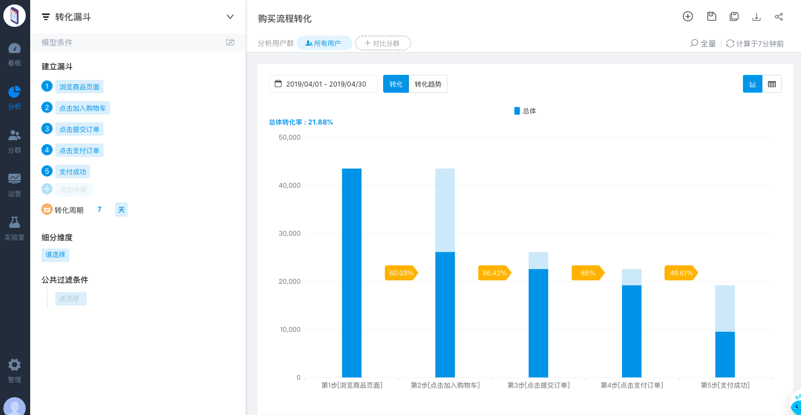

# 3. 创建分析模型

可视化埋点 部署成功后，用户触发事件即可上传数据，通过方舟[转化漏斗分析模型](../../features/analytics/funnel.md)，即可查看购买流程的转化情况。

创建流程转化漏斗主要有4个步骤：

第一步：选择**分析-转化漏斗**分析模型

第二步：**建立漏斗**：浏览商品页面→点击加入购物车→点击提交订单→点击支付订单→支付成功

第三步：**选择时间范围**，比如2019/04/01-2019/04/30

第四步：对分析的漏斗**命名并保存**，便于查看和分析

为了便于日常监控或查看数据，可以把分析图表添加到[看板](../../features/dashboard.md)中。


[tracking-plan.md](../tracking-plan.md)



以上内容没有解答我的问题？[点击我进入方舟论坛去反馈](https://www.analysysdata.com/forum/index) 🚀

